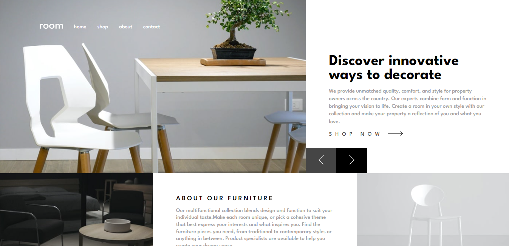
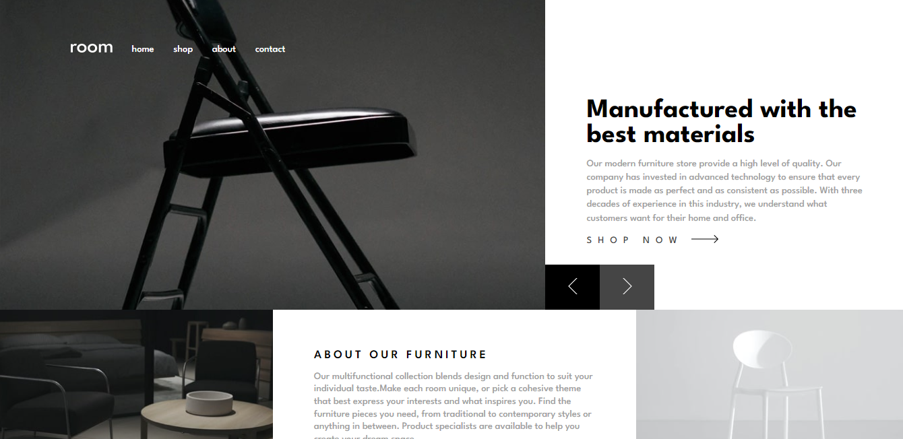
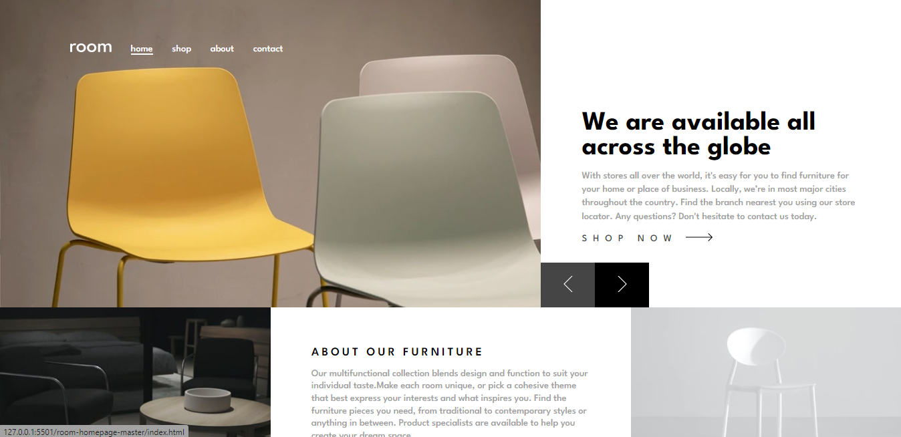

# Frontend Mentor - Room homepage solution

This is a solution to the [Room homepage challenge on Frontend Mentor](https://www.frontendmentor.io/challenges/room-homepage-BtdBY_ENq). Frontend Mentor challenges help you improve your coding skills by building realistic projects. 

## Table of contents

- [Overview](#overview)
  - [The challenge](#the-challenge)
  - [Screenshot](#screenshot)
  - [Links](#links)
- [My process](#my-process)
  - [Built with](#built-with)
- [Author](#author)

## Overview

### The challenge

Users should be able to:

- View the optimal layout for the site depending on their device's screen size
- See hover states for all interactive elements on the page
- Navigate the slider using either their mouse/trackpad or keyboard

### Screenshots

### Links

- [Solution URL](https://github.com/Khemmie-Ray/Room-homepage-slider.git)
- [LiveSite](https://room-homepage-slider.netlify.app/)

## My process

### Built with

- Semantic HTML5 markup
- CSS
- Flexbox
- JavaScript
- Mobile-first workflow

## Author

- Frontend Mentor - [@Khemmie-Ray](https://www.frontendmentor.io/profile/yourusername)
- Twitter - [@haramide](https://www.twitter.com/haramide)# Frontend Mentor - Room homepage solution

This is a solution to the [Room homepage challenge on Frontend Mentor](https://www.frontendmentor.io/challenges/room-homepage-BtdBY_ENq). Frontend Mentor challenges help you improve your coding skills by building realistic projects. 

## Table of contents

- [Overview](#overview)
  - [The challenge](#the-challenge)
  - [Screenshot](#screenshot)
  - [Links](#links)
- [My process](#my-process)
  - [Built with](#built-with)
- [Author](#author)

## Overview

### The challenge

Users should be able to:

- View the optimal layout for the site depending on their device's screen size
- See hover states for all interactive elements on the page
- Navigate the slider using either their mouse/trackpad or keyboard

### Screenshots

### Links

- [Solution URL](https://github.com/Khemmie-Ray/Room-slider-homepage.git)
- [LiveSite](https://room-slider-homepage.vercel.app//)

## My process

### Built with

- React
- TailwindCSS
- Mobile-first workflow

## Author

- Frontend Mentor - [@Khemmie-Ray](https://www.frontendmentor.io/profile/Khemmie-Ray)
- Twitter - [@haramide](https://www.twitter.com/haramide)